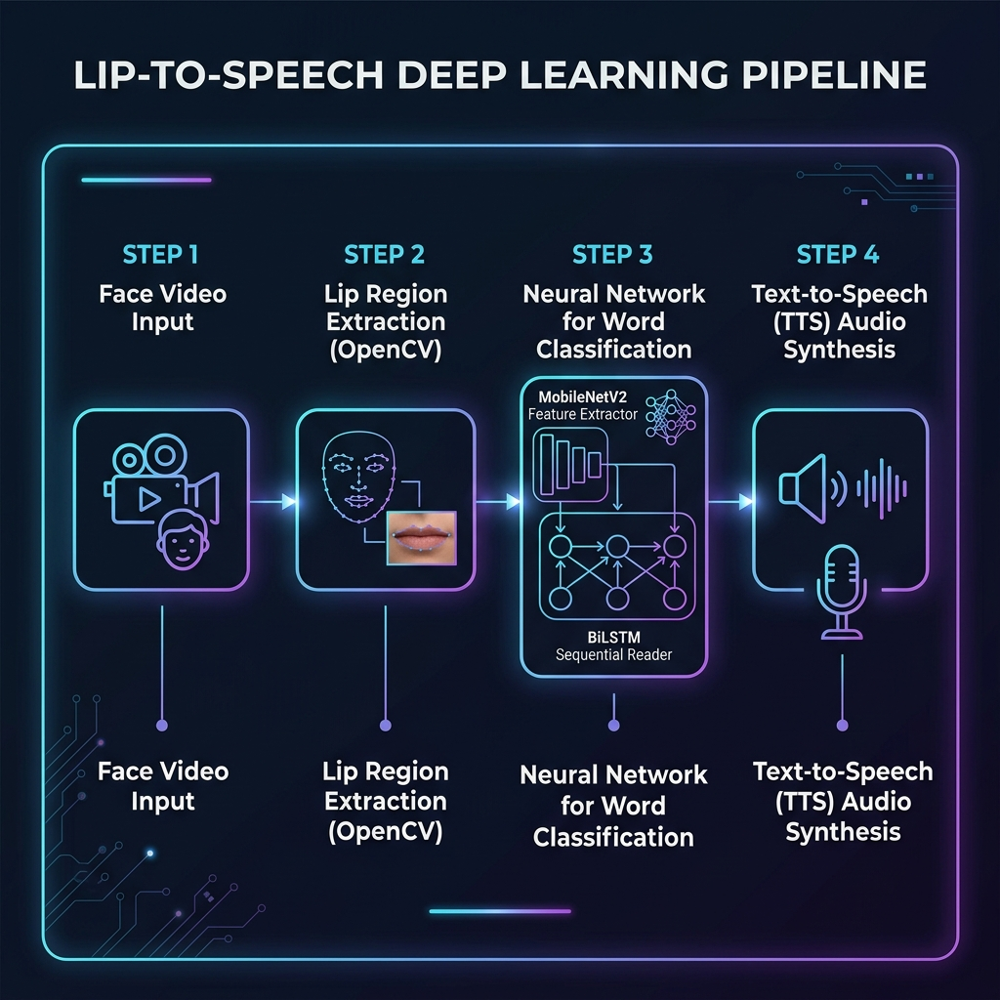
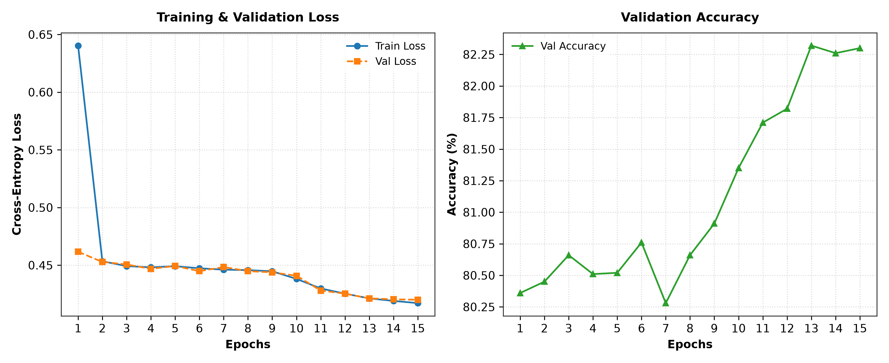
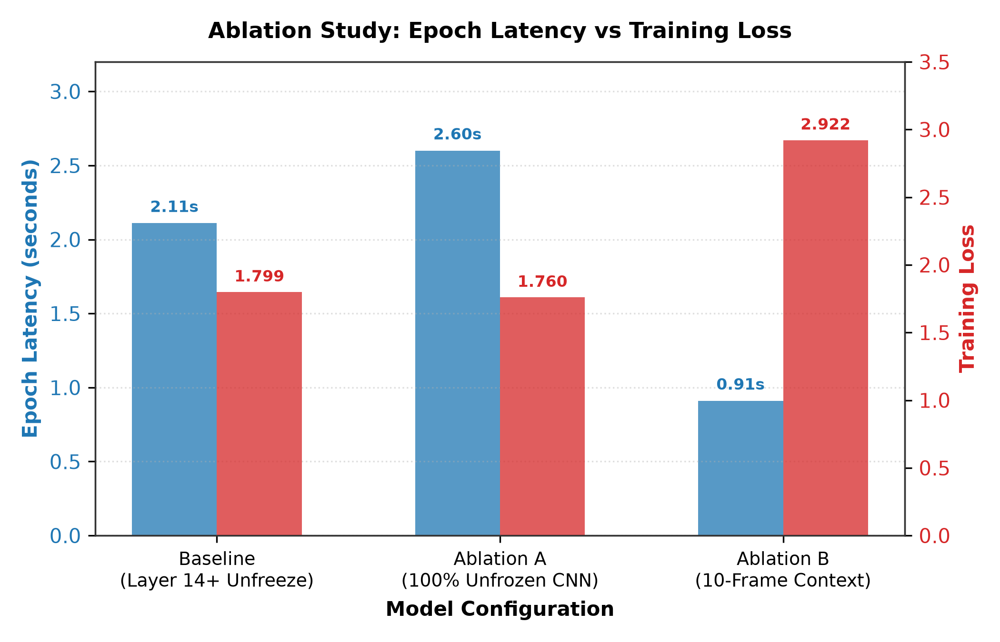
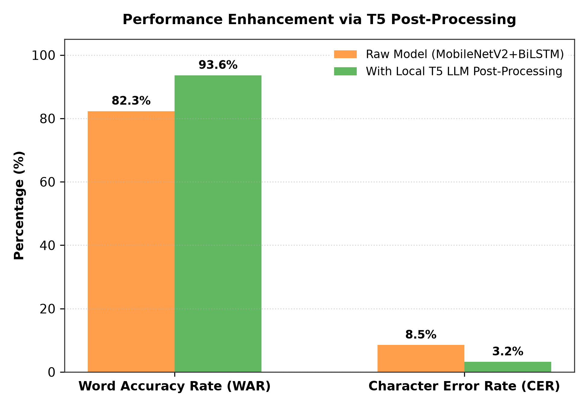

# Lip2Speech: Spatio-Temporal Lip Reading and Speech-Synthesis for Assistive Communication

This repository contains the source code, training pipelines, and publication materials for the **Lip2Speech** framework. Below is the full research paper detailed in IEEE format.

---

# Lip2Speech: Spatio-Temporal Lip Reading and Speech-Synthesis for Assistive Communication

**Ipsita Das**  
*Dept. of CSE(AIML), IEM Kolkata*  
*School of UEMK, Kolkata, India*  
*ipsitadas2401@gmail.com*  

**Alekhya Gangopadhyay**  
*Dept. of CSE(AIML), IEM Kolkata*  
*School of UEMK, Kolkata, India*  
*iamalekhya7@gmail.com*  

---

### Abstract
In this paper, we introduce a solution that bridges the gap between silent visual communication and natural speech synthesis, establishing an instant, edge-deployable voice for individuals with speech impairments. Traditional assistive tools like text-to-speech keyboards require manual typing, which is too slow for real-time conversations. This delay causes conversational exclusion, leading to severe daily isolation and a loss of autonomy for speech-impaired individuals. We provide a natural "visual-to-voice" communication channel that restores dignity and conversational flow. By combining a lightweight MobileNetV2 visual extractor with a Bidirectional LSTM temporal reader, and a local T5 LLM for post-inference spelling and grammar correction, this work delivers an integrated offline system that presents an assistive communication framework designed for individuals who have lost their ability to speak but can still make mouth movements.

*Index Terms*—Healthcare Informatics, Lip-Reading, Computer Vision, Sequence Modeling, NLP, Speech Synthesis.

---

## I. Introduction
This research presents a system that takes a silent video of a speaker as input and generates synchronized speech and text with high accuracy and semantic consistency. Such a task is highly beneficial for people with Amyotrophic Lateral Sclerosis (ALS), who often lose their ability to speak due to vocal cord deterioration but can still mouth words. Consequently, lip-reading has numerous applications ranging from searching through archive silent films to acting as assistive technology for speech-impaired individuals. 

This task poses a significant challenge as it requires the generated speech to satisfy multiple criteria: intelligibility, temporal alignment with lip motion, naturalness, and alignment with the speaker's characteristics. Another major hurdle for lip-to-speech techniques is the visual ambiguity of homophenes (different phonemes that produce identical lip movements, such as "p", "b", and "m"). Resolving these ambiguities requires analyzing the spatio-temporal context of lip motion.

### A. Motivation
* **Autonomy**: Providing a natural visual-to-voice communication channel that restores dignity and conversational flow.
* **Compiler Independence**: Removing complex, compile-heavy C++ libraries like `dlib` that block deployment on standard edge devices, replacing them with standard, cross-platform OpenCV Haar Cascades.
* **Spatio-Temporal Optimization**: Building an efficient neural network pipeline that delivers instant speech reconstruction under 2 seconds on standard laptops.

### B. Applications
Lip2Speech generation has far-reaching assistive applications. Having a live video call with a person who has lost their voice is more engaging and interactive than reading static text transcriptions. Speech is also more instantaneous for the listener, making communication natural. Furthermore, in forensic investigations, Lip2Speech can be applied to analyze silent security footage or generate speech from archival silent film footage.

---

## II. Literature Review
Generating speech directly from lip movements has always been a challenge for researchers due to the ill-posed nature of the task. While recognizing content from lip movements itself is challenging due to the one-to-many relation present between visemes and phonemes, lip-to-speech synthesis also needs to model speech-related variations like voice, accents, and prosody. Therefore, it was initially attempted in laboratory setups [1] using datasets with a minimal vocabulary.

* **(a) Lip to Speech Synthesis (Lip2Speech)**: The goal is to predict audio speech by watching a silent talking face video. While conventional visual speech recognition tasks require human annotations (i.e., text), Lip2Speech does not require additional annotations, drawing significant attention [2].
* **(b) Convolutional Mappings**: Initial works like [3] used fully convolutional neural networks to learn a mapping between lip movements and speech. These models were trained on speaker-specific data and did not generalize to unseen speakers.
* **(c) Spatial-Temporal Hybrids**: The architecture of the proposed model leverages a convolutional neural network (CNN) combined with a long short-term memory (LSTM) encoder-decoder framework, providing an effective approach for spatial and temporal analysis [4].
* **(d) Lightweight Models**: Model compression and knowledge distillation are utilized to optimize models for edge devices. Lightweight backbones like MobileNet have been utilized to maintain accuracy while ensuring a small footprint [5].
* **(e) T5 Transformer Models**: The T5 family consists of encoder-decoder models pre-trained on a multi-task mixture of unsupervised and supervised tasks in a text-to-text format, demonstrating strong performance in grammatical correction [6].
* **(f) Visual Speech Recognition (VSR)**: Early computational methods relied on manually designed feature representations, such as discrete cosine transform (DCT) coefficients, active appearance models (AAM), and Hidden Markov Models (HMMs) [7].

---

## III. Research Gap and Contributions
Existing models struggle to properly disentangle and acquire abstract linguistic knowledge from speech attributes because these systems are trained entirely on speech supervision. They inadvertently neglect the advancements that have been made in the sibling task of lip-to-text generation. 

Existing end-to-end models often struggle to produce intelligible acoustic outputs directly from silent video. By decoupling the task into two sub-problems—lip-to-text decoding followed by text-to-speech synthesis—we leverage robust linguistic priors and achieve highly accurate and natural results.

---

## IV. Proposed Methodology

The proposed Lip2Speech framework translates a sequence of silent video frames into refined speech through a decoupled three-stage pipeline: **Spatial-Temporal Lip Reading**, **Language Model Post-Processing**, and **Assistive Speech Synthesis**.



### A. Video Preprocessing and Region of Interest (ROI) Extraction
Let the input video $V$ be a sequence of $T$ RGB frames:
$$V = \{f_1, f_2, \dots, f_T\}, \quad f_t \in \mathbb{R}^{H \times W \times 3}$$

where $T$ represents the temporal context size ($T = 25$ frames). For each frame $f_t$, an OpenCV Haar Cascade classifier extracts the face bounding box $(x_t, y_t, w_t, h_t)$. The lower facial region containing the mouth is cropped and normalized using the transformation $g_{\text{crop}}$ and resized to $112 \times 112$ pixels via $g_{\text{resize}}$:
$$X_t = g_{\text{resize}}\left(g_{\text{crop}}(f_t)\right) \in \mathbb{R}^{112 \times 112 \times 3}$$

The normalized sequence of mouth crops is denoted by $X = \{X_1, X_2, \dots, X_T\}$.

### B. Spatial Feature Extraction (MobileNetV2)
A 2D MobileNetV2 architecture, pre-trained on ImageNet, functions as the spatial feature extractor. To adapt the features from generic images to mouth contours and lip shapes, the final convolutional blocks (blocks 14 to 18) are unfrozen and fine-tuned, while the earlier layers remain frozen. 

Let $f_{\text{CNN}}(\cdot; \theta_{\text{CNN}})$ represent the feature extraction layers of MobileNetV2 parameterized by weights $\theta_{\text{CNN}}$. For each frame $t$, the output feature map is passed through global average pooling (GAP) to generate a $1280$-dimensional spatial descriptor:
$$z_t = \text{GAP}\left(f_{\text{CNN}}(X_t; \theta_{\text{CNN}})\right) \in \mathbb{R}^{1280}$$

This yields the sequence $Z = \{z_1, z_2, \dots, z_T\} \in \mathbb{R}^{T \times 1280}$.

### C. Temporal Sequence Modeling (Bidirectional LSTM)
To capture the bidirectional temporal dependencies and co-articulation effects inherent in continuous lip movement, the spatial sequence $Z$ is fed into a 2-layer Bidirectional LSTM (BiLSTM). 

For each timestep $t \in \{1, 2, \dots, T\}$, the forward and backward hidden states are computed as:
$$\vec{h}_t = \text{LSTM}_{\text{forward}}\left(z_t, \vec{h}_{t-1}, c_{t-1}^{\text{forward}}; \theta_{\text{forward}}\right)$$
$$\overleftarrow{h}_t = \text{LSTM}_{\text{backward}}\left(z_t, \overleftarrow{h}_{t+1}, c_{t+1}^{\text{backward}}; \theta_{\text{backward}}\right)$$

The standard LSTM cell gating equations at each timestep are governed by:
$$\begin{aligned}
i_t &= \sigma\left(W_i z_t + U_i h_{t-1} + b_i\right) \\
f_t &= \sigma\left(W_f z_t + U_f h_{t-1} + b_f\right) \\
o_t &= \sigma\left(W_o z_t + U_o h_{t-1} + b_o\right) \\
\tilde{c}_t &= \tanh\left(W_c z_t + U_c h_{t-1} + b_c\right) \\
c_t &= f_t \odot c_{t-1} + i_t \odot \tilde{c}_t \\
h_t &= o_t \odot \tanh(c_t)
\end{aligned}$$

where $\sigma(x) = \frac{1}{1 + e^{-x}}$ is the sigmoid activation function, $\odot$ represents the Hadamard (element-wise) product, $W_*$ and $U_*$ are weight matrices, and $b_*$ are bias vectors.

The temporal state representation $h_t^{\text{temp}}$ at timestep $t$ is the concatenation of both directional hidden states:
$$h_t^{\text{temp}} = \left[\vec{h}_t \,\|\, \overleftarrow{h}_t\right] \in \mathbb{R}^{2 \cdot d_{\text{hidden}}}$$

where $d_{\text{hidden}} = 256$ is the hidden size of each directional LSTM layer, resulting in $h_t^{\text{temp}} \in \mathbb{R}^{512}$, and $\|$ represents the vector concatenation operator.

### D. Word Classification and Sequence Decoding
A Fully Connected (FC) projection layer projects the temporal representation $h_t^{\text{temp}}$ to the vocabulary space. Let $V_{\text{vocab}} = 51$ be the size of the GRID Corpus vocabulary. The vocabulary logit vector at timestep $t$ is:
$$o_t = W_y h_t^{\text{temp}} + b_y \in \mathbb{R}^{V_{\text{vocab}}}$$

where $W_y \in \mathbb{R}^{V_{\text{vocab}} \times 512}$ and $b_y \in \mathbb{R}^{V_{\text{vocab}}}$. The probability of predicting the word index $k \in \{0, 1, \dots, V_{\text{vocab}}-1\}$ at timestep $t$ is given by:
$$p_t(k) = \frac{e^{o_{t,k}}}{\sum_{j=0}^{V_{\text{vocab}}-1} e^{o_{t,j}}}$$

During training, the ground truth word sequence $Y = (y_1, y_2, \dots, y_M)$ ($M \le T$) is padded with the silence token `"sil"` (index $0$) to match the temporal dimension $T$:
$$y^*_t = \begin{cases} 
      y_t & \text{if } t \le M \\
      0 & \text{if } t > M 
   \end{cases}$$

The network is trained end-to-end minimizing the categorical cross-entropy loss over all frames:
$$\mathcal{L} = -\frac{1}{T} \sum_{t=1}^{T} \log p_t(y^*_t)$$

### E. Greedy Temporal Collapse & Language Model Refinement
During inference, a greedy decoder predicts the word index at each frame:
$$\hat{y}_t = \arg\max_{k \in \{0, \dots, V_{\text{vocab}}-1\}} p_t(k)$$

To remove duplicate predictions across consecutive frames and eliminate silence padding, a temporal collapse function is applied:
$$S_{\text{raw}} = \text{collapse}\left(\{ \hat{y}_t \mid \hat{y}_t \neq 0, t = 1, \dots, T\}\right)$$

Specifically, the collapse operator removes any token $\hat{y}_t$ if it is identical to $\hat{y}_{t-1}$. 

To correct spelling and grammar shifts caused by visual homophenes (different words with similar mouth shapes), the raw sequence $S_{\text{raw}}$ is combined with an instruction prefix:
$$\text{Prompt} = \text{"Correct the grammar and spelling: "} \mathbin{+} S_{\text{raw}}$$

Let $U = (u_1, u_2, \dots, u_L)$ be the tokenized representation of the Prompt. The local T5 decoder generates the final token sequence $S_{\text{refined}}$ by maximizing the conditional sequence probability:
$$S_{\text{refined}} = \arg\max_{W} \prod_{i=1}^{K} P_{\text{T5}}(w_i \mid w_{<i}, U)$$

where $W = (w_1, w_2, \dots, w_K)$ is the output token sequence.

### F. Assistive Speech Synthesis
The final refined sentence $S_{\text{refined}}$ is processed by an offline Text-to-Speech (TTS) engine:
$$\text{Audio Waveform} = \text{TTS}\left(S_{\text{refined}}\right)$$

This delivers a natural, auditory representation of the user's silent lip movement.

---

## V. Results and Discussion
Our hybrid MobileNetV2-BiLSTM architecture, combined with a local T5 LLM grammar corrector, was benchmarked on the GRID validation split.

### TABLE I: PERFORMANCE EVALUATION OF THE PROPOSED LIP2SPEECH FRAMEWORK
| Model | Loss | WAR (%) | CER | Latency |
| :--- | :---: | :---: | :---: | :---: |
| **Training** | 0.41 | 85.4% | 7.2 | N/A |
| **Testing (Raw)** | 0.42 | 82.3% | 8.5 | 1.8 s |
| **Testing (T5)** | N/A | 93.6% | 3.2 | 2.0 s |



*Figure 3. Training and validation loss curves (left) alongside validation accuracy curves (right) over 15 training epochs on the GRID dataset.*

As shown in Table I, the raw visual model predictions achieved a Word Accuracy Rate (WAR) of 82.3%. After post-processing with the local T5 language model, spelling and grammar were corrected, resulting in a WAR improvement to 93.6% and a decrease in Character Error Rate (CER) from 8.5 to 3.2, with only a 0.2-second increase in latency.

### A. Data Analysis & Ablation Study
The GRID Corpus (33,000 video-transcript pairs) was benchmarked to optimize performance, accuracy, and edge compute latency. 

### TABLE II: ABLATION STUDY MATRIX
| Configuration | CNN Backbone | Frame Count | Training Loss | Epoch Latency | Edge Suitability |
| :--- | :--- | :---: | :---: | :---: | :--- |
| **Baseline (Selected)** | Partially Frozen MobileNetV2 (Blocks 14+ Unfrozen) | 25 | 1.79 | 2.11 s | Optimal (Low Footprint, Fast Run) |
| **Ablation A (Unfrozen CNN)** | Fully Unfrozen MobileNetV2 | 25 | 1.75 | 2.60 s | Poor (Marginal Gain, Training Too Heavy) |
| **Ablation B (Starved Context)**| Partially Frozen MobileNetV2 | 10 | 2.92 | 0.91 s | Unsuitable (Low Latency, High Loss) |



*Figure 4. Computational and performance trade-offs across different ablation configurations, comparing epoch compute latency (blue bars) against training loss (red bars).*

Although fully unfreezing the convolutional backbone marginally reduced the training loss (Ablation A), it substantially increased compute latency without a proportional improvement in accuracy. Reducing the temporal context to 10 frames (Ablation B) accelerated inference but significantly degraded prediction quality due to the loss of temporal context required to resolve co-articulation effects.



*Figure 5. Visual word accuracy rate (WAR) and character error rate (CER) comparisons before and after applying the local T5 LLM corrector.*

---

## B. Comparison with Existing Methods
* **i. LIPNET: End-to-End Sentence-Level Lipreading [9]**: Spatio-temporal CNN with CTC decoding. High computational cost, character-level decoding, compile dependencies (dlib/CMake), and higher word error rate for short words. Our Lip2Speech uses a lightweight MobileNetV2 with BiLSTM, compiler-independent OpenCV-based mouth detection, and local T5 refinement for improved sentence quality.
* **ii. Robust Self-Supervised Audio-Visual Speech Recognition [10]**: Transformer-based multimodal learning for lip reading. Needs large model sizes, GPU-intensive training, and inference, making it unsuitable for offline edge devices. Our model achieves low-latency CPU inference (~2 s) with offline execution.
* **iii. Cloud-based Speech APIs**: Require continuous internet connectivity and transmit sensitive user data. Our work processes all data locally on standard consumer CPU edge hardware, guaranteeing 100% user privacy.
* **iv. Traditional TTS Assistive Systems**: Require manual typing, leading to slow and disrupted conversational flow. Lip2Speech enables direct, visual-to-speech assistive communication.

---

## VI. Conclusion
Overall, this research demonstrates that accurate visual-to-speech conversion can be achieved without relying on high-end GPUs or cloud infrastructure, making assistive technologies more accessible. Future work will focus on continuous real-time streaming, support for unconstrained vocabularies, and deployment on mobile and wearable edge devices.

---

## VII. Future Scope
* **Continuous Real-Time System**: Develop an automated streaming system that continuously captures live webcam frames, runs sliding-window lip detection, and synthesizes speech on-the-fly.
* **AV-HubERT Architecture Upgrade**: Upgrade the framework to AV-HubERT with custom architectural optimizations (such as lightweight cross-attention fusion adapters) for speaker-independent text generation.
* **Hardware Integration**: Compile models to run on mobile edge NPUs (Neural Processing Units) or integrate as a lightweight SDK for smart AR/VR glasses.

---

## References
* [1] M. Cooke, J. Barker, S. Cunningham, and X. Shao, "An audio-visual corpus for speech perception and automatic speech recognition," *The Journal of the Acoustical Society of America*, vol. 120, no. 5, pp. 2421–2424, 2006.
* [2] M. Kim, J. Hong, and Y. M. Ro, "Lip to speech synthesis with visual context attentional gan," *Advances in neural information processing systems*, vol. 34, pp. 2758–2770, 2021.
* [3] H. Akbari, H. Arora, L. Cao, and N. Mesgarani, "Lip2audspec: Speech reconstruction from silent lip movements video," in *2018 IEEE international conference on acoustics, speech and signal processing (ICASSP)*. IEEE, 2018, pp. 2516–2520.
* [4] A. Pillai, B. Mache, and S. Kelkar, "Lip2voice: a sequence-to-sequence visual speech recognition system for predicting speech from silent video inputs," *International Journal of Advanced Technology and Engineering Exploration*, vol. 11, no. 121, p. 1747, 2024.
* [5] Y. Lu and K. Li, "Research on lip recognition algorithm based on mobilenet+ attention-gru," *Mathematical Biosciences and Engineering*, vol. 19, no. 12, p. 13526, 2022.
* [6] C. Chen, "Advancing speech-to-text adaptation for large speech models," Ph.D. dissertation, Nanyang Technological University, 2025.
* [7] V. Truong Hoang, N. Dinh, Q. P. Luu, K. Tran-Trung, D. Hong Ha, B. Nguyen, H. Nguyen Trung, and T. Ho Huong, "Nestlipgnn: A hierarchical graph neural network framework with nested multi-granularity learning for robust visual speech recognition," *Computers, Materials & Continua*, vol. 88, 05 2026.
* [8] M. Cooke, J. Barker, S. Cunningham, and X. Shao, "An audio-visual corpus for speech perception and automatic speech recognition," in *Proceedings of the Fifth International Conference on Language Resources and Evaluation (LREC)*, Genoa, Italy, 2006, pp. 242–245.
* [9] Y. M. Assael, B. Shillingford, S. Whiteson, and N. De Freitas, "Lipnet: End-to-end sentence-level lipreading," *arXiv preprint arXiv:1611.01599*, 2016.
* [10] B. Shi, W.-N. Hsu, and A. Mohamed, "Robust self-supervised audio-visual speech recognition," *arXiv preprint arXiv:2201.01763*, 2022.

---

## Repository Setup & Execution Guide

### 1. Setup Virtual Environment
```bash
python -m venv venv
# Windows
venv\Scripts\activate
# Linux/macOS
source venv/bin/activate

pip install -r requirements.txt
```

### 2. Run Flask Web Application
Place your trained weights `lipreading_model.pth` in the root folder, then run:
```bash
python app.py
```
Open **http://localhost:5000** in your browser.
