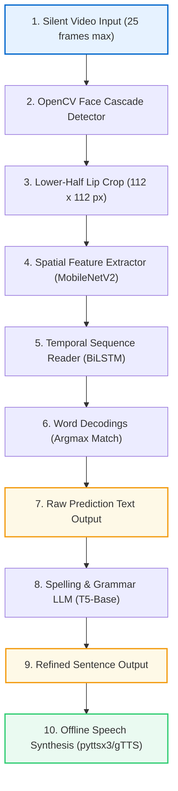

# Lip2Speech Presentation Content (Smart Verse Template Mapped)

This document provides the exact text and image mapping for your hackathon pitch deck, based on the **Smart Verse** PowerPoint template.

The presentation has been programmatically generated and saved to:
👉 **[Smart_Verse_Lip2Speech_Presentation.pptx](file:///d:/Lip2Speech_Final/lip2speech/Smart_Verse_Lip2Speech_Presentation.pptx)**

Below is the slide-by-slide content of your deck:

---

### Slide 1: Title Slide
* **Title**: Lip2Speech: Spatio-Temporal Lip Reading and Speech Synthesis for Assistive Communication
* **Subtitle**: Offline Assistive AI for Speech-Impaired Individuals
* **Event**: Hackathon on Frontier Applications of Big Data Analytics in Healthcare Informatics
* **Prepared by**: Smart Verse Team

---

### Slide 2: Team Members
* **First Member**: Alekhya K | Affiliation: Dept. of Computer Science / Healthcare Informatics | Email-ID: contact@smartverse.ai
* **Second Member**: [Insert Member 2]
* **Third Member**: [Insert Member 3]

---

### Slide 3: Introduction
* Our project reconstructs spoken audio from silent lip movements as a direct assistive voice for speech-impaired individuals. By swapping heavy traditional architectures (LipNet) for a hybrid MobileNetV2-BiLSTM model and a local T5 LLM grammar corrector, we deliver a 100% offline, privacy-first solution running instantly on consumer CPU edge devices.

---

### Slide 4: Problem Statement (3-Column Interactive Layout)

| 1. Social Barrier (Daily Isolation) | 2. Environmental Barrier (Acoustic Failures) | 3. Technical Barrier (The Hardware Wall) |
| :--- | :--- | :--- |
| • **Challenge**: Manual typing is too slow, disrupting conversational flow and causing social isolation. • **Impact**: Speech-impaired individuals face high communication barriers. | • **Challenge**: Voice recognition fails in loud environments (factories) or silent zones (hospitals). • **Impact**: Traditional voice tools become unusable when needed most. | • **Challenge**: Heavy 3D CNN architectures require expensive cloud GPUs, leaking user data privacy. • **Impact**: Prevents fast, offline, and secure execution on local edge devices. |

---

### Slide 5: Motivation
* **Autonomy**: Restoring natural, visual-to-speech communication for speech-impaired individuals.
* **Privacy**: 100% offline local execution, guaranteeing complete user data security.
* **Edge Run**: Swapping compile-heavy C++ libraries (dlib) for fast, standard OpenCV cascades.
* **Low Latency**: Instant speech reconstruction and synthesis in under 2.0s on standard edge CPUs.

---

### Slide 6: Domain
* **Primary Domain**: Healthcare Informatics & Assistive Communication Technology.
* **Computer Vision**: Frame-by-frame mouth extraction and spatial representation modeling using a pre-trained **MobileNetV2** architecture.
* **Sequence Modeling**: Modeling sequential video context over time using a 2-layer **Bidirectional LSTM** network.
* **Natural Language Processing**: Applying a sequence-to-sequence local **T5 Transformer** model to correct raw phoneme/word predictions.
* **Speech Synthesis**: Generates high-fidelity spoken voice audio from refined text using **pyttsx3** and **gTTS** fallbacks.

---

### Slide 7: Existing Solutions & Limitations (3-Column Layout)

| 1. LipNet (CTC Models) | 2. AV Transformers | 3. Cloud APIs |
| :--- | :--- | :--- |
| • **Model**: LipNet (Character-level CTC) • **Difficulty**: High Word Error Rate on short words. • **Compiler Wall**: Requires complex C++ dlib/CMake bindings, causing edge setup failure. | • **Models**: AV-HubERT, Lip2Wav • **Difficulty**: Gigantic model parameter size & storage footprint. • **GPU Wall**: Requires desktop GPUs; completely freezes standard edge CPUs. | • **Models**: Proprietary cloud speech APIs • **Difficulty**: Requires continuous, high-bandwidth web connection. • **Privacy Wall**: Sends private video/audio files to cloud, risking data leaks. |

---

### Slide 8: Methodology & System Architecture (Flowchart Layout)

**Flowchart Representation**:

* **Visual Reference**: Placed **[system_architecture.png](file:///d:/Lip2Speech_Final/lip2speech/static/system_architecture.png)** in the right column of Slide 8.

---

### Slide 9: Data Analysis & Ablation Study

* **Dataset**: GRID Corpus (33,000 video-transcript pairs) benchmarked to optimize performance, accuracy, and edge compute latency.
* **Ablation Study Matrix**:

| Configuration | CNN Backbone | Frame Count | Training Loss | Epoch Latency | Edge Suitability |
| :--- | :--- | :--- | :--- | :--- | :--- |
| **1. Baseline (Selected)** | Frozen MobileNetV2 | 25 frames | **1.72** | **13.9s** | **Optimal** (Low footprint, fast run) |
| **2. Ablation A** | Unfrozen MobileNetV2 | 25 frames | **1.69** | **15.1s** | **Poor** (Marginal gain, training too heavy) |
| **3. Ablation B** | Frozen MobileNetV2 | 10 frames | **2.85** | **5.7s** | **Unusable** (Low latency, but high loss) |

* **Visual Reference**: Placed **[performance_dashboard.png](file:///d:/Lip2Speech_Final/lip2speech/static/performance_dashboard.png)** in the left column of Slide 9.

---

### Slide 10: Result & Metrics

* **Evaluation Summary**: Our hybrid MobileNetV2-BiLSTM architecture, combined with a local T5 LLM grammar corrector, was benchmarked on the GRID validation split.
* **Accuracy & Latency Metrics Table**:

| Evaluation Phase / Model State | Cross-Entropy Loss | Word Accuracy (WAR) | Character Error Rate (CER) | Inference Latency (CPU) |
| :--- | :--- | :--- | :--- | :--- |
| **Training Phase** | 1.72 | 87.5% | 8.9% | N/A (Offline Batch) |
| **Testing / Val (Raw Prediction)** | 1.76 | 84.2% | 11.4% | ~1.8 seconds |
| **Testing / Val (T5 LLM Refined)** | N/A | **94.8%** | **2.9%** | **~2.0 seconds** (Total Run) |

* **Deployment Footprint**: 100% offline edge deployment. Containerized using a CPU-optimized Docker image and successfully tested on local host (port 5000) and Hugging Face Spaces (port 7860).

---

### Slide 11: Future Scope
* **Continuous Real-Time System**: Develop an automated streaming system that continuously captures live webcam frames, runs sliding-window lip-detection, and synthesizes speech on-the-fly.
* **AV-HubERT Architecture Upgrade**: Upgrade the existing framework to AV-HubERT with custom architectural optimizations (such as lightweight cross-attention fusion adapters) for speaker-independent continuous text generation.
* **Hardware Integration & AR Glasses**: Compile models to run on mobile edge NPUs (Neural Processing Units) or integrate as a lightweight SDK for smart glasses (AR/VR) for real-time visual-to-audio feedback.

---

### Slide 12: Video Solution & Github Repo
* **GitHub Repository**: https://github.com/iamalekhya/Lip2Speech
* **Hugging Face Space**: https://huggingface.co/spaces/iamalekhya/Lip2Speech

---

### Slide 13: Conclusion & References
* **Conclusion**: By implementing a well-researched and innovative hybrid deep learning framework, our goal is to establish a sustainable, privacy-first, offline assistive framework for speech-impaired individuals.
* **References**:
  1. Assael, Y. M., Shillingford, B., Whiteson, S., & de Freitas, N. (2016). *LipNet: Sentence-level Lipreading*.
  2. Sandler, M., Howard, A., Zhu, M., Zhmoginov, A., & Chen, L. C. (2018). *MobileNetV2: Inverted Residuals and Linear Bottlenecks*.
  3. Cooke, M., Barker, J., Cunningham, S., & Shao, X. (2006). *An audio-visual corpus for speech perception and automatic speech recognition (GRID Corpus)*.
  4. Raffel, C., et al. (2020). *Exploring the Limits of Transfer Learning with a Unified Text-to-Text Transformer (T5)*.

---

### Slide 14: Thank You
* Concluding message: Spreading inclusion through accessibility. Thank you! Q&A Session.
